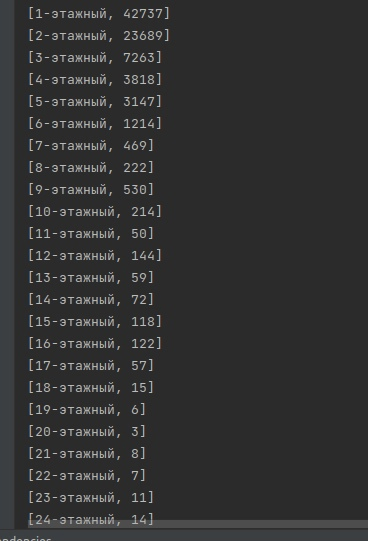

Вариант 1.
Выполнил Георгий Чукин 
план работ
<pre>
Парсинг CSV
Запись в классы
запись в таблицы БД
Запросы SQL по 3 пунктам, вывод результатов
для 1 пункта отрисовка графика
</pre> 
1 пункт:
<pre>
Постройте график.
По Х дома с определенным количеством 
этажей(1, 2, 3, 4, 5 и тд) 
по Y количество таких домов.
</pre> 

 
2 пункт:
<pre>
Найдите зарегистрированные участки,
по улице шлиссельбургское шоссе 
с префиксом 9881.

</pre>
 
 
3 пункт:
<pre>
Найдите «университеты», 
выше 5 этажа 
с известным годом постройки
и вычислите средний prefix_code
</pre>
 

